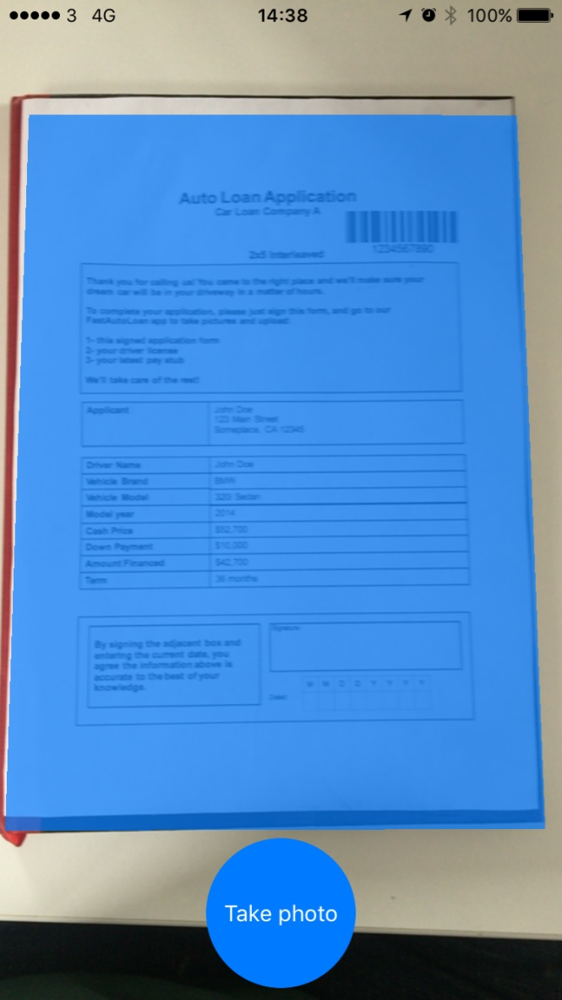
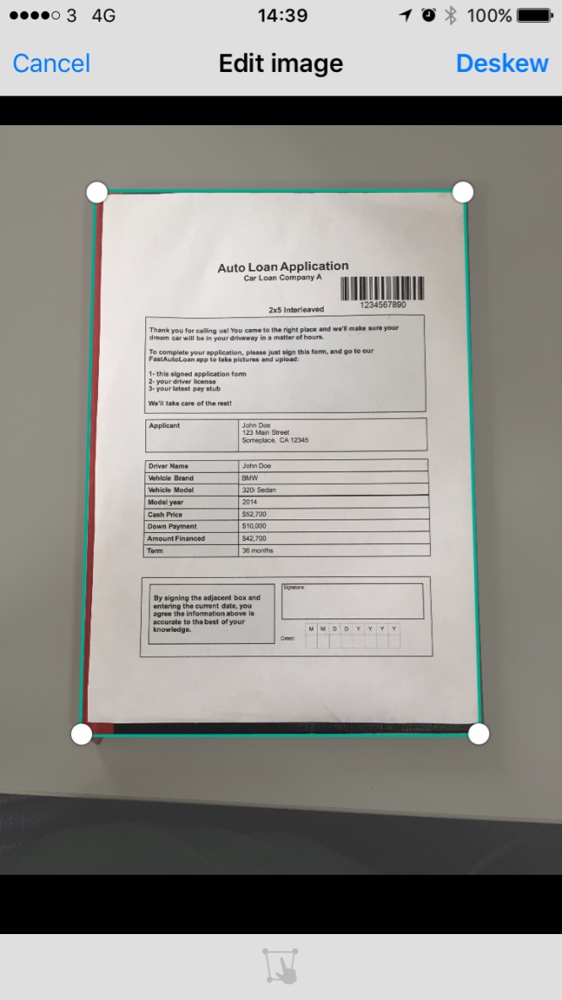
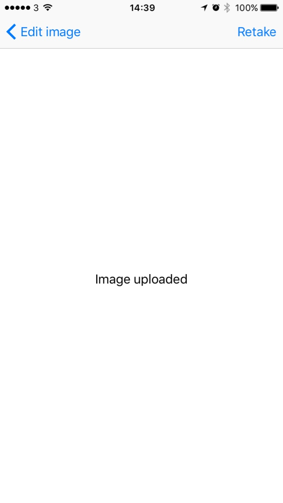

# Welcome

This document will provide you information about how to install and use the source code that demonstrate how to use the IBM Datacap Mobile SDK to capture and upload a document.

# Overview

The sample source code provided is intended to demonstrate the usage of the Datacap Mobile SDK to capture an image using an iOS device and upload it to a Datacap server. The app starts with a fullscreen preview of the camera stream. By taking a photo, the user is given the chance to edit the crop area of the image and, then upload it to a Datacap server.

### Screenshots

# Prerequisites

This document assumes the reader has a working knowledge of IBM Datacap, the Swift language and the iOS platform.

#### SDK Prerequisites

Here are the prerequisites for using the SDK:

- An IBM Datacap server that runs IBM Datacap 9.0.1 or later
- A mobile phone running iOS 8.1 or later
- A computer running Xcode 7.3 or later
- The IBM Datacap Mobile SDK 9.0.1 or later package

# Installation

Copy the archive on the computer where Xcode is installed.
From Xcode select "Open ..." > and select the IBM-AutoCaptureSample-iOS.xcodeproj file.

# Setup

**Before you can run the sample app you need to configure the batch configurations in the app !**

Basically, you need to replace the values of the struct **SampleDatacapConfiguration** found in [**ImageUploadViewController.swift**](IBM-AutoCaptureSample-iOS/ImageUploadViewController.swift).

This values need to reflect a valid batch configurated on a reachable IBM Datacap server instance.

**If you do not replace this values you will not be able to upload the image !**

## LICENSE

[Apache License Version 2.0](../LICENSE)

